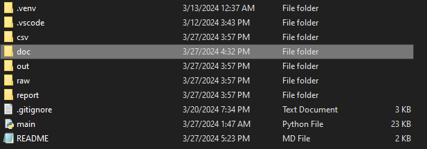

![logo-tight] 
# Bugtracker-Tool
>This code is presented AS-IS with no warranty or support implied or otherwise and provided entirely free.

## Instructions (tl;dr)

1. Clone the repository into a local directory
2. Create a virtual environment (advised)
3. Add BeautifulSoup, urllib, and lxml libraries
4. Copy text from Bugtracker and put into raw subdirectory
5. Run the tool

## Verbose Instructions
These are for the more patient or frustrated, if the terse instructions didn't work

**Clone the repository into a local directory**
Clone the repository into a local directory.  You will want to ensure this has access to the internet when you run the tool as it will call the Bug Tracker resource for each individual issue to get the detailed reports and compile that into the html report at the end.

{:style="left: left;margin-left: 7px;margin-top: 7px;"}  
The tool will build a a data structure to store the various intermediate files as it runs.  By default, it will create the raw, out, csv, and report directories and use them for those purposes.  You can override these defaults on the command line or designate other directories (or even a new home) be used if desired.  This would make the most sense if the tool is running from a bin directory and you want the data files to be located in say /opt/bugscrub/ for example.

It is advised to at least create the raw subdirectory so you can put the input content there when the tool is run.  Otherwise the first run wont do anything but create the directory structure.

**Create a virtual environment (advised)**
Its not necessary to create a virual environment, but highly advised as you can load in the specific libraries and dependencies of your choice and ensure you will not pollute the general dependencies of the system.  The needs of the tool are not extensive, or essoteric, so its your choice.

**Add BeautifulSoup, urllib, and lxml libraries**
You will need to install some dependencies that are used:

[_Beautiful Soup_](https://pypi.org/project/beautifulsoup4/)
```
pip install beautifulsoup4
```

It shouldn't be necessary, as BS4 should add these dependencies, but just in case you may also need to resolve:

[_urllib_](https://pypi.org/project/urllib3/)
```
pip install urllib3
```

[_lxml_](https://pypi.org/project/lxml/)
```
pip install lxml
```

**Copy text from Bugtracker and put into raw subdirectory**
You will need to start [here](https://my.f5.com/manage/s/bug-tracker) to collect content to run through the tool.  I would also advise having a text editor of some sort handy.  [Notepad++](https://notepad-plus-plus.org/) is a solid solution for Windows.  *nix has a number of solutions, pick whatever it is you prefer.  The text editor's role is to ensure **only** text is copied off the web site and all of the images and other garbage are left behind.  Its a little hackey.. but it was faster than trying to scrape the site programatically, and because you cannot get a single page of output it wasn't worth the effort anyhow.


**Run the tool**


[logo-tight]:    ./img/logo_tight.png
[logo-small]:    ./img/logo_small.png
