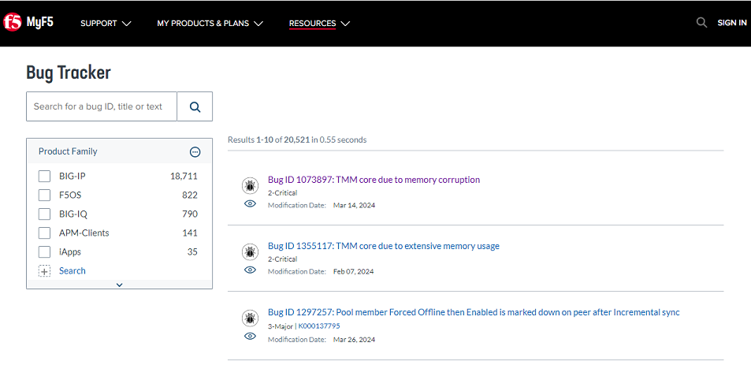
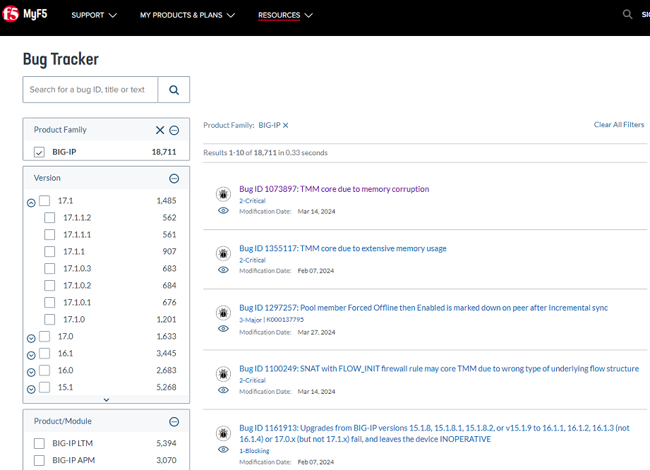
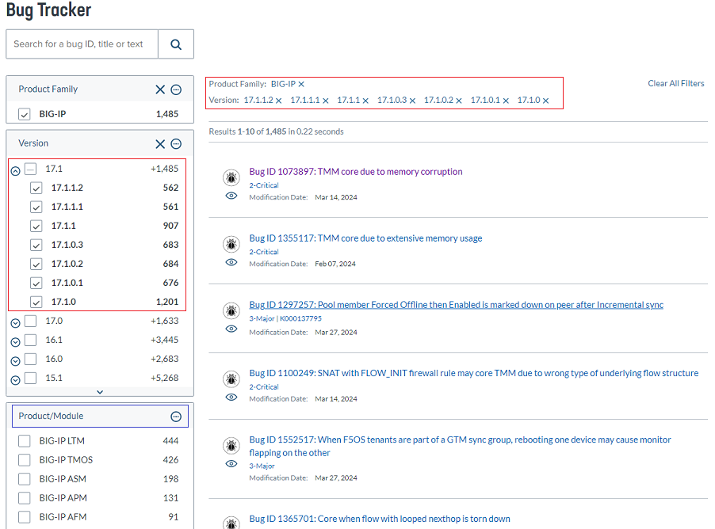
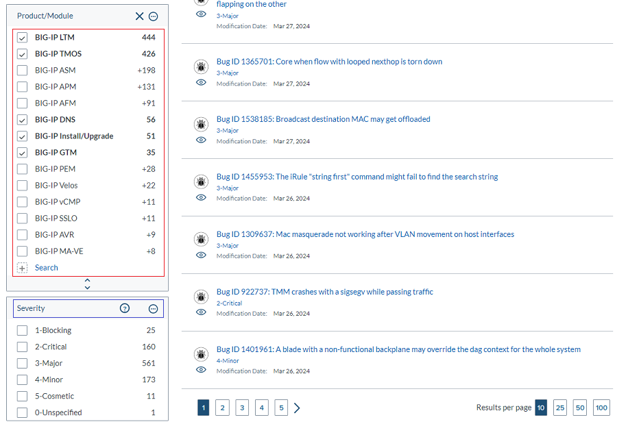
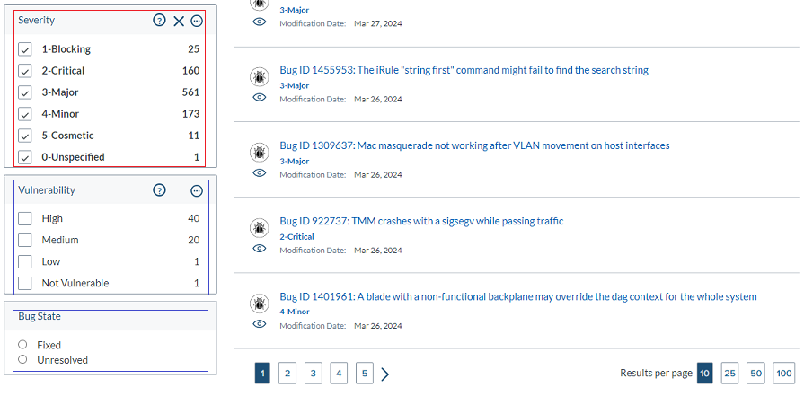
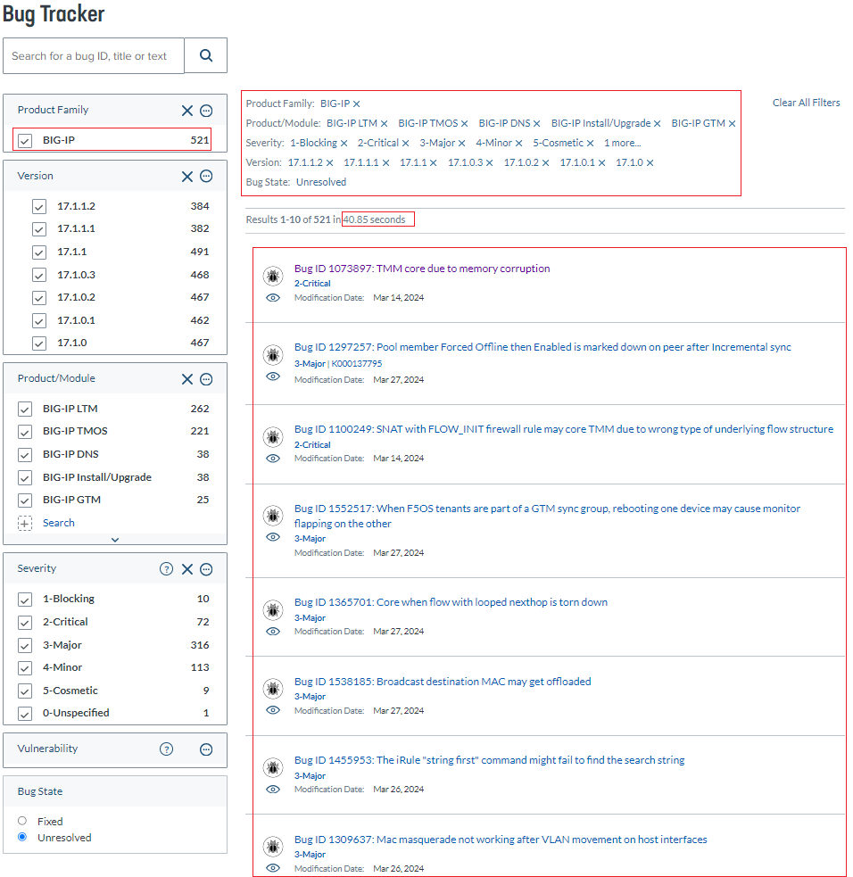
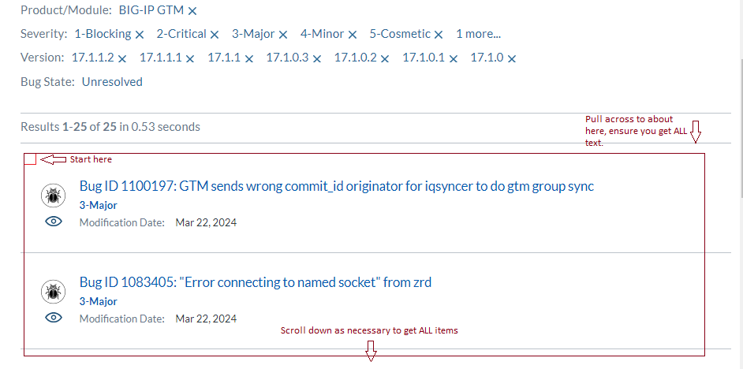
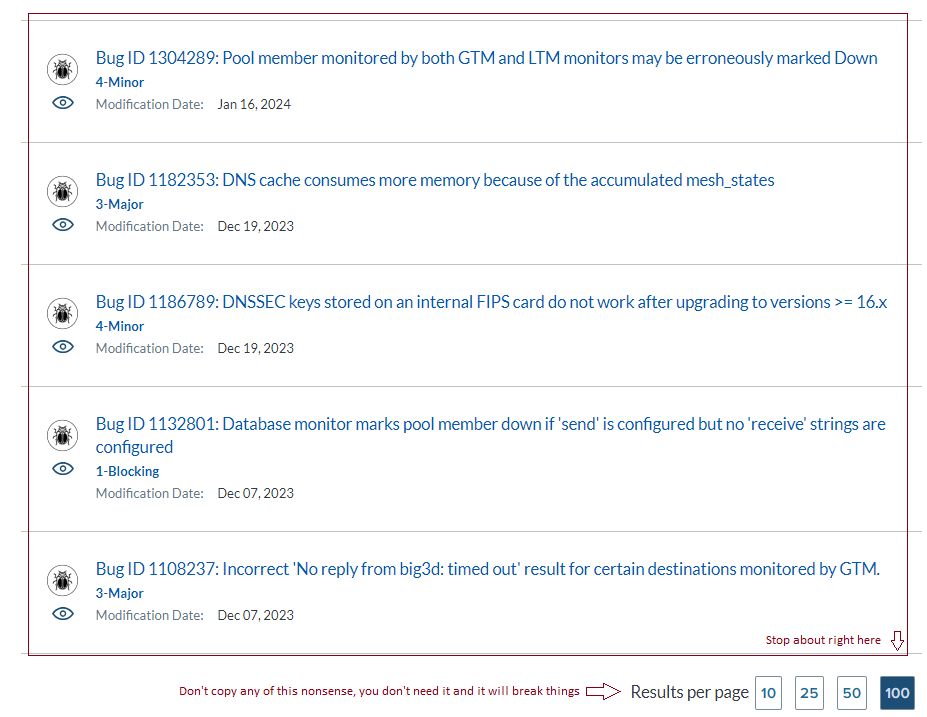
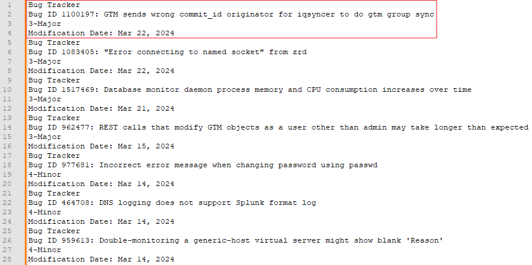
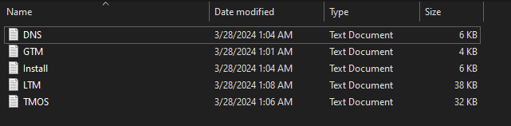

![logo-tight] 
# Bugtracker-Tool
>This code is presented AS-IS with no warranty or support implied or otherwise and provided entirely free.

## Instructions (tl;dr)

1. Clone the repository into a local directory
2. Create a virtual environment (advised)
3. Add BeautifulSoup, urllib, and lxml libraries
4. Copy text from Bugtracker and put into raw subdirectory
5. Run the tool

## Verbose Instructions
These are for the more patient or frustrated, if the terse instructions didn't work

**Clone the repository into a local directory**
Clone the repository into a local directory.  You will want to ensure this has access to the internet when you run the tool as it will call the Bug Tracker resource for each individual issue to get the detailed reports and compile that into the html report at the end.


The tool will build a a data structure to store the various intermediate files as it runs.  By default, it will create the raw, out, csv, and report directories and use them for those purposes.  You can override these defaults on the command line or designate other directories (or even a new home) be used if desired.  This would make the most sense if the tool is running from a bin directory and you want the data files to be located in say /opt/bugscrub/ for example.

It is advised to at least create the raw subdirectory so you can put the input content there when the tool is run.  Otherwise the first run wont do anything but create the directory structure.

**Create a virtual environment (advised)**
Its not necessary to create a virual environment, but highly advised as you can load in the specific libraries and dependencies of your choice and ensure you will not pollute the general dependencies of the system.  The needs of the tool are not extensive, or essoteric, so its your choice.

**Add BeautifulSoup, urllib, and lxml libraries**
You will need to install some dependencies that are used:

[_Beautiful Soup_](https://pypi.org/project/beautifulsoup4/)
```
pip install beautifulsoup4
```

It shouldn't be necessary, as BS4 should add these dependencies, but just in case you may also need to resolve:

[_urllib_](https://pypi.org/project/urllib3/)
```
pip install urllib3
```

[_lxml_](https://pypi.org/project/lxml/)
```
pip install lxml
```

**Copy text from Bugtracker and put into raw subdirectory**
You will need to start [here](https://my.f5.com/manage/s/bug-tracker) to collect content to run through the tool.  I would also advise having a text editor of some sort handy.  [Notepad++](https://notepad-plus-plus.org/) is a solid solution for Windows.  *nix has a number of solutions, pick whatever it is you prefer.  The text editor's role is to ensure **only** text is copied off the web site and all of the images and other garbage are left behind.  Its a little hackey.. but it was faster than trying to scrape the site programatically, and because you cannot get a single page of output (unless its less that 100 items) it wasn't worth the effort anyhow.

First, a brief overview and some suggestions on Bug Tracker.  Bug Tracker is a very convenient tool for customers and employees to find publicly available information on issues with products.  Previously, this was a process relegated to internal tools and the protections from restricted items, like embargoed bugs, were not well implemented.  However, while anyone can compile a list of issues the data format once it is assembled is not easy to use or work with.  I expect now, that I have invested this time, this will rapidly change.. its the cigratte and bus stop paradigm and apparently unavoidable.

The interface to the resource, as of 2024.03.27, looks as follows:



A single query can be run from the dialog box in the upper left that says, "Search for a bug ID, title or text."  This is of little use to us.  Below that dialog is a dialog with selectable items, or product families.  As these are selected some additional options are provided.  It is here that you can refine the list of issues that you want to focus in on.

>The tool, when processing raw files into a combined CSV (or excel) sheet will combine whatever files it has found in the raw directory.  It will take the name of each of those files and use that to designate the family for those issues in the combined CSV.  For that reason, its advisable to break up the screen grabs into families and then name them AFM.txt, TMOS.txt, and so on so that that the end results of the tool will make the most sense and have the most value.

So, for example;  If we wanted to get a bugscrub of all LTM and GTM issues with 17.1 or greater we would do the following:

***Step 1***
Select the Family BIG-IP and allow the interface to adjust and provide additional options



***Step 2***
Normally, we would focus on a specifc version, but in the interest of documenting with some complexity we will we want everything 17.1 or greater at the time we are doing this.  So select all of the 17.1.x.x versions available.

>The interface is a little wonkey and tries to update on the backend as you make selections.  A better design would allow you to make some selections and apply them but I suppose that would reduce the dynamism of the site.  For that reason, be a little patient as you make these selections and allow the web interface to properly update rather than trying to check as fast as possible.

>Notice also that across the top the filter selections are printed as well as the client area is update to reflect the changes in the db query.



***Step 3***
Now move to the product/Module dialog.  You may need to scroll downward.  Additionally there is a small down arrow at the bottom of the dialog that will reveal all of the available options.  It is worthwhile to select that as well so you can see the options available to you (some will not be obvious at first, and note that you may also be able to expose more multiple times.).

The request was for LTM and GTM, however the product name GTM was changed to DNS so you will want to select that as well, as you cannot be 100% certain how issues will be catagorized and more issues are better than missing ones.  In addition, while it was not specifically requested you should also include TMOS and Install/Upgrade as TMOS can potentially impact all products and Install/Upgrade absolutely will.

You may need to consider other options like Velos or vCMP.  There will likely be other options in the future as well.  Consider carefully not only the specific products but supporting and logistical categories.



***Step 4***
With the Products/Modules selected, we can move on to the Severity.  This is where things can start to get a little tricky.  Because the interface will automatically update its important to note what is going on with options below Severity.  There may be vulnerabilites you can select and if you are being requested for ALL vulnerabilites regardless of issue severity, you may need to over select severity wise to drive the most options for vulnerabilites.  Consequently, If you select specific Vulnerability levels, ALL other results get filtered out.  This is another reason for breaking up your scrapes into multiple files.

Here, we will select everything as its easy to trim off things we dont want later.  So select ALL Severities and ensure you allow the interface to update as you do so.



***Step 5***
We could select Vulnerabilities, or check them all but for our example we are going to skip them (as they will isolate our report to ONLY vulnerabilties) but this is where you could select those categories and save a raw files like vuln.txt.  For now, we will select a Bug State of Unresolved (meaning that these issues are still present in the filtered selections above - which is why a specific version makes more sense) and then review how many issues we have to scrape.  It may take a little time for the page to update for this filter.

***Step 6***
With the final filter in place, we now how our list of issues



Notice that we, in this example, now have 521 bugs to handle.  We can see all the filters that have been applied and that the last query took 40.85 seconds to complete (so Bug State can take some time, be patient).  The next step is to essentially copy the client area into a text editor, and then write out to a file.

>Hang on.. recall that we wanted to split these into individual files, one for each product/module.  So what we will do now, is unselect all but the product/module we want, scrape, write the text file out, and the select the other items.  When we are done, we should have 521 items.. otherwise we missed something and need to go back and review our work.

Start with GTM (it has 25 issues), clear all the other product modules.  Now scroll to the bottom of the page and select 100 items per page, so we don't have to paginate.

Begin your text selection This is a bit tricky to explain in text so look at the next two images for clarity.  You want to the entire client area without any menu or extra nonsense.  JUST the bugs.  Dont worry about graphics and other stuff in here, that will get handled in a minute.



Copy all the way through to the bottom like so:  This is where that wheel on the mouse is going to help out.  I don't know how Mac users deal with this.. tough - mouse wheels have been around for 20 years, ask the 'genius' how to cope with it.



Copy and paste this into a text editor.  The resulting paste should look about like this:



Notice the red outlined area is a single issue.  If you did this correctly, the text file should be a series of these.  Occassionally you will see a K Article as well, don't worry about it - it does get handled.  Since this is all for the GTM issues, save this as GTM.txt into the raw folder.

Continue to do this for the remaining items, selecting them one at a time in the Product/Module dialog.  For selections that have more than 100 items in it, like LTM, you will need to paginate and concatenate the txt file until you have all of it.  Continue until you have collected all the issues and saved the txt files into the raw directory:



Now we are ready to process into something we can work with.

**Run the tool**
Help for the tool is listed as follows:
```
usage: Bugtracker-Tool [-h] [-d HOME] [-t OUT] [-r RAW] [-c CSV] [-o REPORT]
                       [-p {1,2,3}] [-x KEYEXCLUDE] [-i KEYINCLUDE]

Bugtracker-Tool is a utility to help quickly take copied content from Bugtrack
(currently: https://my.f5.com/manage/s/bug-tracker), and process the output to
create a spreadsheet, coalate and produce an HTML report. The tool does
require some work to get proper outputs and is not intended to do all the work
for you. Processing starts in the rawdir directory, cleaned text files being
writted to the outdir. Then the files in outdir are parsed and convereted to
the csvdir, as well as all of them being concatenated into consolidated csv
file. Lastly, the csvdir is parsed for the ALL.csv file (default) and the
written into an html report to the reportdir.

options:
  -h, --help            show this help message and exit
  -d HOME, --home HOME  Home default directory in which other processing
                        directories are located. Full paths area accepted
  -t OUT, --out OUT     Directory relative to homedir that processed raw files
                        are output to clean text. Full paths will be stripped
  -r RAW, --raw RAW     Directory relative to homedir that unprocessed files
                        exist. Full paths will be stripped.
  -c CSV, --csv CSV     Directory relative to homedir that csv files are
                        written to. Full paths will be stripped
  -o REPORT, --report REPORT
                        Directory relative to homedir that output report files
                        are output to. Full paths will be stripped
  -p {1,2,3}, --process {1,2,3}
                        Process level. Raw->Out, Out->CSV, CSV->Report:
                        1->2->3: Indicates where processing starts from.
  -x KEYEXCLUDE, --keyexclude KEYEXCLUDE
                        Regex signatures to exclude line items from. Only
                        during report phase, against title, and takes
                        precedence over keyinclude list
  -i KEYINCLUDE, --keyinclude KEYINCLUDE
                        Regex signatures that must pass to be added to report.
                        Only during report phase, against title, and
                        keyexclude takes precedence

Additional details on collecting the raw input are provided on the github
site: https://github.com/caliraftdude/bugtracker-tool
```


[logo-tight]:    ./img/logo_tight.png
[logo-small]:    ./img/logo_small.png
